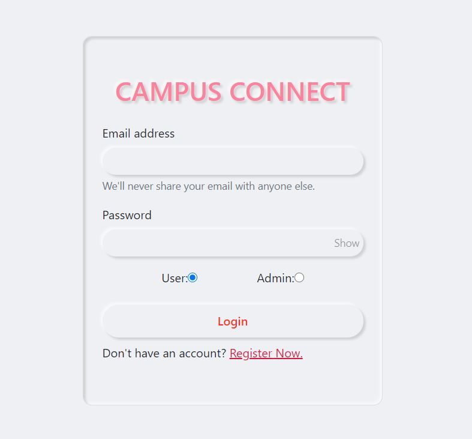
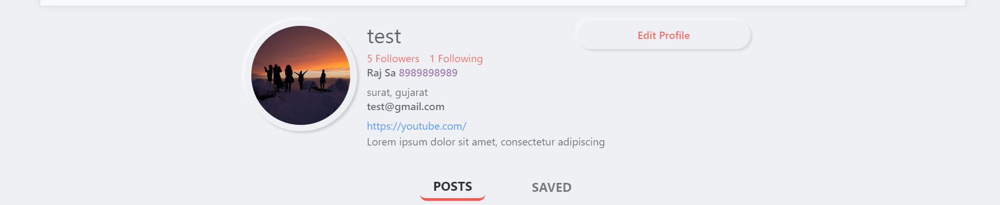
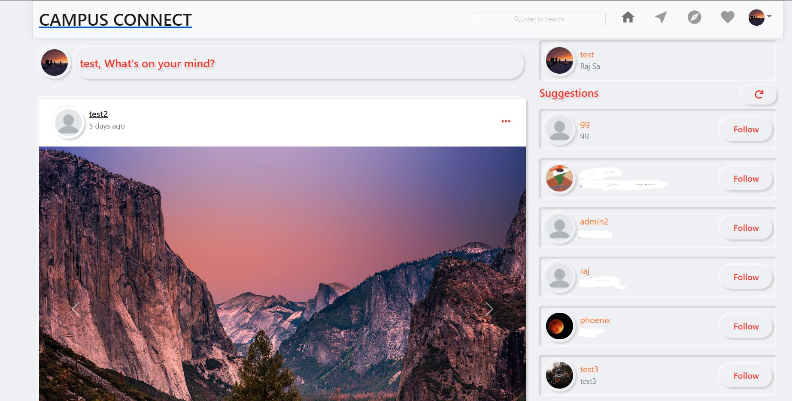
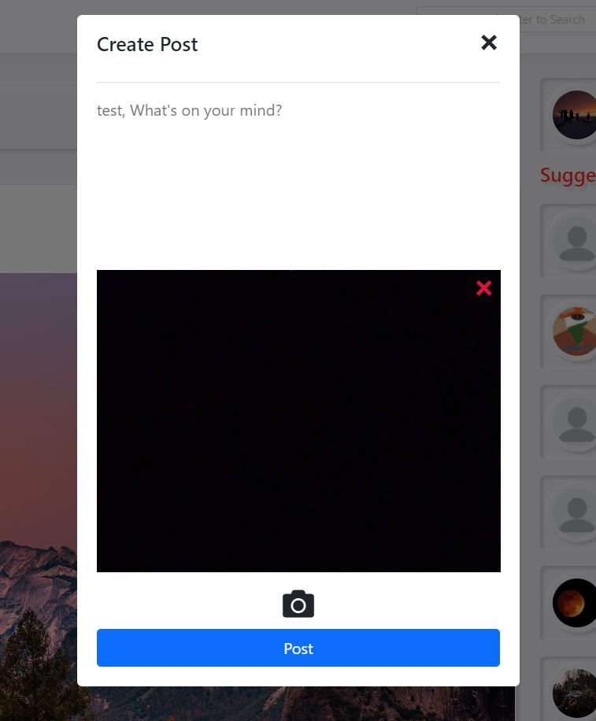
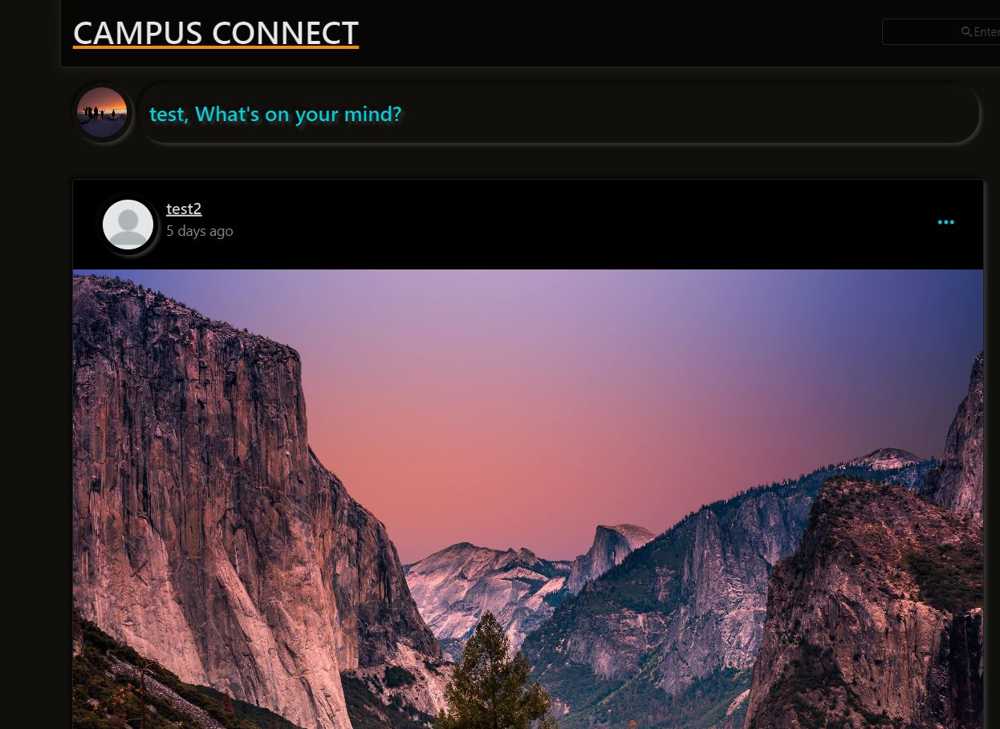
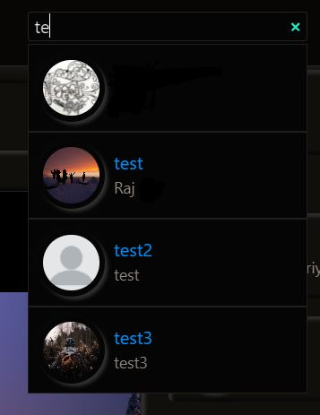
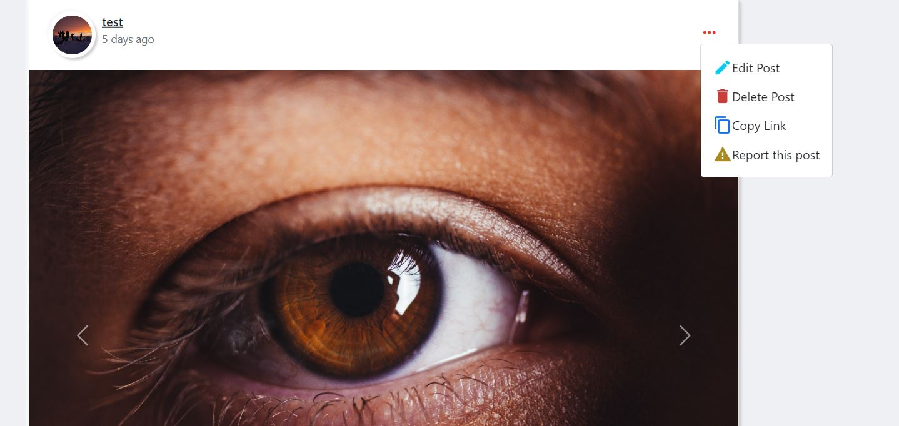
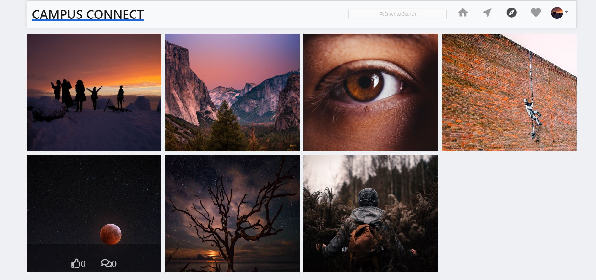

# Campus Connect

A MERN stack-based social media application for Web Technology Course Project.

---

## 🚀 Features

### 👤 User Features
- Register and login users.
- Upload post images using camera or file system.
- Pagination on every page.
- Dark mode.
- Copy post links.
- Report posts for spam.
- Search users by username.
- User suggestions menu.
- Save posts to collections.
- Saved posts page.
- Delete posts and comments.
- Explore page to view posts by random users.
- Notifications page with clear option.
- Profile page with posts, followers, and following menu.
- Edit profile data.
- Passwords stored in encrypted format with salt.
- Create and edit posts.
- Like, comment, share, and edit posts.
- Posts include captions and images.
- Comment and reply on posts.
- Like comments.

### 🛠️ Admin Features
- Admin panel shows total users, posts, and reported posts.
- Admin can assign or create other admin accounts.
- View posts reported by more than a specified number of users.
- Delete reported posts.

---

## 🛠 Requirements

- Node.js
- MongoDB (local or MongoDB Atlas)
- Cloudinary account
- NPM

---

## 🧩 How to Run the Application

1. Ensure MongoDB is running locally or available online.
2. Add MongoDB database link to the `.env` file.
3. Add your Cloudinary credentials in `/client/src/utils/imageUpload.js`.
4. Clone this repository.
5. Open terminal in the cloned folder:
    - To install backend dependencies:  
      ```bash
      npm install
      ```
    - To start the backend server:  
      ```bash
      node server
      ```
    - Navigate to the `/client` folder and install frontend dependencies:  
      ```bash
      cd client
      npm install
      ```
    - To start the frontend:  
      ```bash
      npm start
      ```
6. Open [http://localhost:3000](http://localhost:3000) in your browser.

---

## 🖼 Screenshots

**Login Page**  


**Profile Page**  


**Home Page**  


**Create New Post**  


**Dark Mode**  


**Search Users**  


**Posts Menu**  


**Explore Page**  


---

